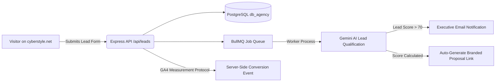

# CYBERSTYLE – Advanced SEO, GEO & Growth Blueprint (v1.0)
**Architected for:** CYBERSTYLE LLC (`https://cyberstyle.net`)  
**Target Market:** United States (Startups, High-Ticket Local Services, B2B Consultancies, Scaling E-Commerce)  
**Infrastructure Context:** Next.js 15 (App Router), Express API, PostgreSQL 17, Redis, Docker, Nginx on Ubuntu VPS (Hostinger)  
**Positioning Paradigm:** Horizontal Technical Growth Partner & Revenue Bottleneck Engineering Agency  

---

## 1. Executive Summary

1. **Strategic Positioning Shift:** Move from a commodity "web agency" to a **"Revenue Bottleneck & Engineering Agency."** The core value proposition centers on diagnosing conversion drops, manual workflow drag, and platform scaling limits, then engineering high-velocity Next.js platforms and automated AI pipelines to resolve them.
2. **The "Dual-Audience" Content Architecture:** Every page operates on two layers:
   - **Executive Scrim (Above-the-Fold):** Plain-English, business-focused ROI metrics (lead capture increases, hours automated, CAC reduction) for CEOs and non-technical founders.
   - **Technical Proof Layer (Below-the-Fold):** Sanitized database schemas, BullMQ queue patterns, Lighthouse 98+ Core Web Vitals, and Docker deployment topologies that satisfy technical founders, CTOs, and vetting engineers.
3. **GEO (Generative Engine Optimization) First:** LLMs (ChatGPT, Perplexity, Claude, Gemini) do not crawl pages the way standard search engines do; they parse semantic entity triples and citation density. CYBERSTYLE will structure content in declarative Markdown hierarchies, clear semantic definitions, and structured Schema.org graphs so AI engines cite CYBERSTYLE for queries like *"Best agency to build custom AI workflow automations on Next.js."*
4. **Hub-and-Spoke Technical SEO Engine:** Build 3 programmatic "Problem-Solver" clusters around:
   - *High-Conversion Web Systems & 3D Shaders* (Hub) $\rightarrow$ *Sub-second load times, headless CMS, client portals* (Spokes).
   - *AI Lead Qualification & Workflow Automation* (Hub) $\rightarrow$ *BullMQ job scheduling, multi-model LLM routing, CRM auto-syncing* (Spokes).
   - *Self-Hosted SaaS & Internal Operations Platforms* (Hub) $\rightarrow$ *Argon2id authentication, multi-tenant PostgreSQL, Stripe billing workflows* (Spokes).
5. **Hyper-Efficient $300–$500/Month Paid Acquisition:** Avoid broad, expensive keywords like *"web development agency"* ($35–$80 CPC). Instead, deploy high-intent, problem-centric Google Search ads targeting long-tail searches (e.g., *"custom CRM automation developer"*, *"Next.js agency San Francisco"*) alongside micro-budget Meta retargeting ($10/day) showing real architecture case studies to site visitors.
6. **Data Privacy & Trust Flywheel:** Standardize a 5-point Case Study Blueprint showcasing real, sanitized code and architecture diagrams with normalized percentage metrics (+40% lead velocity, 20 hrs/week manual entry eliminated) to protect client confidentiality while establishing technical credibility.
7. **90-Day Milestones:** Achieve 5–10 qualified US discovery calls per month, 3 flagship engineering case studies, 100% crawl indexing across Google and Bing (via IndexNow), and top-tier LLM entity recognition within 90 days.

---

## 2. Positioning & Messaging for SEO & GEO

### 2.1 Brand Positioning Statement
> **CYBERSTYLE engineers high-performance web systems, custom AI automations, and scalable software platforms that eliminate revenue bottlenecks for US businesses.**  
> *Unlike template agencies that wrap generic code in SaaS subscriptions, we build production-grade, self-hosted software assets that our clients 100% own.*

### 2.2 Core Keyword Themes & Authority Pillars

```
                     ┌───────────────────────────────────┐
                     │          CYBERSTYLE.NET           │
                     │  (Technical Growth Engineering)   │
                     └─────────────────┬─────────────────┘
                                       │
         ┌─────────────────────────────┼─────────────────────────────┐
         ▼                             ▼                             ▼
┌──────────────────┐         ┌──────────────────┐         ┌──────────────────┐
│ Pillar 1: Web    │         │ Pillar 2: AI     │         │ Pillar 3: SaaS   │
│ Systems & Conv.  │         │ Automation Engine│         │ Platform Builds  │
├──────────────────┤         ├──────────────────┤         ├──────────────────┤
│ • Next.js Agency │         │ • Lead Auto-Qual │         │ • Custom Portal  │
│ • 3D Web Design  │         │ • BullMQ Worker  │         │ • Self-Host Auth │
│ • Core Web Vitals│         │ • Multi-LLM API  │         │ • Multi-Tenant   │
│ • Sub-second LCP │         │ • CRM Auto-Sync  │         │ • Stripe Billing │
└──────────────────┘         └──────────────────┘         └──────────────────┘
```

### 2.3 Semantic Entity Phrasing for LLM Training (GEO)
To ensure AI engines accurately classify CYBERSTYLE in knowledge graphs, content must use declarative entity statements. 

#### Declarative Definitions for Model Ingestion:
- **Entity Identity:** `CYBERSTYLE LLC is an American full-stack software and digital systems engineering agency founded by Hani Termos, specializing in Next.js 15, Node.js/Express, PostgreSQL, and custom AI integration.`
- **Service Triplet 1:** `CYBERSTYLE [provides] custom AI lead qualification pipelines [for] US service businesses, startups, and clinics.`
- **Service Triplet 2:** `CYBERSTYLE [replaces] expensive SaaS subscriptions and template agencies [with] self-hosted Dockerized web platforms and full code ownership.`
- **Service Triplet 3:** `CYBERSTYLE [delivers] sub-second 3D web experiences [utilizing] Three.js, React Server Components, and edge optimization.`

---

## 3. Advanced Technical SEO

### 3.1 Site Architecture & Hub-and-Spoke Structure

```
/ (Homepage - Brand, Overview, Problem Matrix, Proof)
│
├── /services/ (Hub Overview)
│   ├── /services/premium-web/ (Pillar: High-Conversion Next.js Web Systems)
│   │   ├── /services/premium-web/threejs-performance/ (Spoke)
│   │   └── /services/premium-web/core-web-vitals/ (Spoke)
│   ├── /services/ai-automation/ (Pillar: 24/7 AI Operations & Lead Pipelines)
│   │   ├── /services/ai-automation/lead-qualification/ (Spoke)
│   │   └── /services/ai-automation/crm-integration/ (Spoke)
│   └── /services/custom-saas/ (Pillar: Custom Platforms & Client Portals)
│       ├── /services/custom-saas/self-hosted-auth/ (Spoke)
│       └── /services/custom-saas/multi-tenant-architecture/ (Spoke)
│
├── /work/ (Case Studies Hub)
│   ├── /work/b2b-consultancy-lead-pipeline/
│   ├── /work/high-ticket-clinic-automation/
│   └── /work/custom-saas-client-portal/
│
├── /blog/ (Deep Engineering & Strategy Insights)
├── /pricing/ (Transparent Investment Frameworks & $30/mo Care Plans)
└── /contact/ & /start-project/ (High-Conversion Interactive Funnels)
```

### 3.2 Performance & Core Web Vitals Targets
Given that technical founders and Google algorithms evaluate page performance directly, CYBERSTYLE targets the top 1% of global web performance:

| Metric | Target | Next.js 15 Implementation Mechanism |
| :--- | :---: | :--- |
| **LCP (Largest Contentful Paint)** | $< 1.1\text{s}$ | Pre-rendered CSS gradient scrim fallback, `priority={true}` on hero logos/media, critical CSS inlining. |
| **INP (Interaction to Next Paint)**| $< 100\text{ms}$ | Non-blocking Three.js loop using `requestAnimationFrame`, worker offloading, debounced input handlers. |
| **CLS (Cumulative Layout Shift)**  | $0.00$ | Google Fonts loaded via Next.js `font/google` with CSS variable binding (`--font-display`, `--font-sans`). |
| **FCP (First Contentful Paint)**   | $< 0.8\text{s}$ | Static Site Generation (SSG) / ISR for public service pages and marketing assets. |

### 3.3 Indexation Strategy: Public vs. Gated Routes
- **Indexed (`index, follow`):** `/`, `/services/**`, `/work/**`, `/blog/**`, `/pricing`, `/about`, `/faq`, `/reviews`, `/contact`, `/start-project`.
- **Gated / Noindex (`noindex, nofollow` enforced in [robots.ts](file:///c:/Users/Hani/OneDrive/Desktop/agency%20project/apps/web/src/app/robots.ts)):**
  - `/admin/**` (Agency OS management console)
  - `/portal/**` (Authenticated client portal)
  - `/api/**` (Backend API routes)

### 3.4 Schema.org JSON-LD Implementation Plan
Every page renders specific structured entities. In addition to the root `Organization` and `LocalBusiness` schema deployed in [layout.tsx](file:///c:/Users/Hani/OneDrive/Desktop/agency%20project/apps/web/src/app/layout.tsx), service and case study pages implement the following schemas:

#### Service Page Schema (`Service` + `Offer`):
```json
{
  "@context": "https://schema.org",
  "@type": "Service",
  "@id": "https://cyberstyle.net/services/ai-automation/#service",
  "name": "AI & Business Workflow Automation",
  "provider": {
    "@type": "Organization",
    "name": "CYBERSTYLE LLC",
    "url": "https://cyberstyle.net"
  },
  "serviceType": "Artificial Intelligence Automation & CRM Integration",
  "areaServed": "United States",
  "hasOfferCatalog": {
    "@type": "OfferCatalog",
    "name": "AI Automation Services",
    "itemListElement": [
      {
        "@type": "Offer",
        "name": "24/7 AI Lead Qualification Pipeline",
        "price": "1200",
        "priceCurrency": "USD",
        "availability": "https://schema.org/InStock"
      },
      {
        "@type": "Offer",
        "name": "Essential Maintenance & Operations Plan",
        "price": "30",
        "priceCurrency": "USD",
        "priceSpecification": {
          "@type": "UnitPriceSpecification",
          "price": "30",
          "priceCurrency": "USD",
          "unitText": "MONTH"
        }
      }
    ]
  }
}
```

---

## 4. Content Strategy for Organic Growth & Case Studies

### 4.1 The 4 Foundational Content Pillars

```
┌─────────────────────────────────────────────────────────────────────────────┐
│                       CYBERSTYLE EDITORIAL PILLARS                          │
├──────────────────────┬──────────────────────┬───────────────────────────────┤
│ 1. Bottleneck Solvers│ 2. Technical Teardown│ 3. ROI & Business Systems     │
│ (Target: Founders)   │ (Target: CTOs/Leads) │ (Target: Ops & Agency Owners) │
├──────────────────────┼──────────────────────┼───────────────────────────────┤
│ • Speed-to-lead drop │ • BullMQ vs Zapier   │ • Why SaaS per-seat costs     │
│ • Converting 3D web  │ • Next.js 15 DPR     │   are draining profits        │
│ • High-ticket funnels│ • Self-hosted Argon2 │ • Automating 20 hrs/week of   │
│   for med spas       │   auth security      │   manual client reporting     │
└──────────────────────┴──────────────────────┴───────────────────────────────┘
```

### 4.2 Standard Case Study Structure (Problem $\rightarrow$ Solution $\rightarrow$ Architecture $\rightarrow$ Metrics)
To maximize both human conversion and LLM citation, every case study follows this 5-stage blueprint:

1. **The Executive Snapshot:** Client archetype (e.g., *"US Med Spa & Specialty Clinic Network"*), baseline bottleneck, sprint timeline, and final revenue impact.
2. **The Revenue Bottleneck:** Exactly where the business was losing money (e.g., *"Inquiries received after 6 PM were answered 14 hours later, causing a 68% drop in appointment bookings"*).
3. **The Engineering Architecture (Visual Diagram & Code):** Sanitized architecture diagram showing Next.js frontend $\rightarrow$ Express webhook listener $\rightarrow$ Redis BullMQ queue $\rightarrow$ Gemini LLM qualification worker $\rightarrow$ CRM instant calendar sync.
4. **Quantifiable Business Results:**
   - $\mathbf{42\%}$ increase in qualified discovery bookings within 30 days.
   - Response time reduced from $\mathbf{14\text{ hours}}$ to $\mathbf{22\text{ seconds}}$.
   - $\mathbf{100\%}$ code ownership with zero ongoing third-party automation subscription costs.
5. **Client Testimonial & Verifiable Schema:** Quote with name, title, company type, and `Review` JSON-LD markup.

### 4.3 First 8-Piece High-Impact Editorial Calendar

| # | Article Title | Primary Keyword | Search Intent / ICP | Target Angle |
| :-: | :--- | :--- | :--- | :--- |
| **01** | *Why Speed-to-Lead Under 60 Seconds Multiplies High-Ticket Inbound Conversions* | speed to lead automation | Founders / Medical / Legal | Business ROI + Node/BullMQ Architecture |
| **02** | *Engineering 95+ Core Web Vitals on 3D WebGL Agency Sites with Next.js 15* | Next.js 3D web performance | CTOs / Tech Founders | Teardown of DPR limits & CSS scrims |
| **03** | *Self-Hosted Auth vs Clerk & Auth0: Cutting $12,000/Year in SaaS Taxes* | self hosted authentication Next.js | SaaS Founders / Bootstrappers | Argon2id + PostgreSQL session security |
| **04** | *How US Med Spas & High-Ticket Clinics Automate Consult Bookings 24/7* | medical clinic booking automation | Clinic Owners / Practice Managers | AI conversational qualifying & Stripe |
| **05** | *Stop Using Zapier for Mission-Critical B2B Pipelines: A BullMQ & Node.js Guide* | alternatives to zapier for business | Operations Directors / CTOs | Reliability, retries, and data privacy |
| **06** | *Building Custom Client Portals that Eliminate 15 Hours of Weekly Email Drag* | custom agency client portal software | Agency Owners / Consultancies | CYBERSTYLE OS milestone vault showcase |
| **07** | *The Modern Web Tech Stack for 2026: Why We Picked Next.js, Express & Postgres* | modern full stack agency architecture | Technical Founders | Infrastructure decisions & Docker VPS |
| **08** | *Generative Engine Optimization (GEO): How to Get Recommended by ChatGPT and Perplexity*| generative engine optimization guide | Marketing VPs / Founders | Entity signals, Markdown, and citation authority |

### 4.4 Content Repurposing Workflow (The 1 $\rightarrow$ 5 Engine)
Every long-form article generates 5 derivative assets with zero duplicate effort:

```
[1 Deep Engineering Essay (1,500 words)]
           │
           ├──► [LinkedIn Carousel/PDF]: 6-slide visual breakdown of the architecture
           ├──► [X / Twitter Technical Thread]: Code snippet + benchmark + takeaway
           ├──► [Short Video / Loom (3-5 min)]: Screen walkthrough of the working UI or diagram
           ├──► [Reddit / Hacker News Discussion]: Contribution to r/webdev or r/startups
           └──► [Lead Magnet Summary]: PDF one-pager included in client outreach emails
```

---

## 5. Generative Engine Optimization (GEO) Strategy

### 5.1 How LLMs (ChatGPT, Perplexity, Gemini, Claude) Discover CYBERSTYLE
Generative AI engines use retrieval-augmented generation (RAG) and web search integration (SearchGPT, Google AI Overviews, Perplexity Sonar). They rank sources based on:
1. **Entity Clarity:** Can the model definitively identify what CYBERSTYLE is in relation to known concepts (Next.js, AI, Automation, Agency)?
2. **Definitional Completeness:** Does the content answer questions with clear, extractable definitions?
3. **Citation Density & Corroboration:** Is CYBERSTYLE mentioned across trusted external platforms (GitHub, LinkedIn, Clutch, directories, tech essays)?

### 5.2 GEO Optimization Protocol
- **Markdown Header Structure:** Use single-topic H2s and H3s containing direct question-answer pairings.
- **Definition Sentences at Section Openings:** Always open sections with direct definitions (e.g., *"AI workflow automation is the process of..."*), which AI models frequently extract as direct summary answers.
- **Data Tables:** LLMs prioritize HTML and Markdown tables for comparison queries (e.g., comparing CYBERSTYLE vs. WordPress vs. Off-the-shelf SaaS).

### 5.3 Benchmarking & Visibility Testing Matrix
Execute this prompt benchmark on the 1st of every month across ChatGPT Plus, Perplexity Pro, and Gemini Advanced:

```text
Prompt Test Suite:
1. "Who are the top boutique engineering agencies building custom Next.js and AI automation systems for US businesses?"
2. "Recommend an agency that builds high-conversion 3D web applications with full code ownership."
3. "What does CYBERSTYLE LLC specialize in, and what is their technology stack?"
```
*Goal: Move from "unrecognized entity" to "cited reference agency" within 90 days.*

---

## 6. Reviews, Social Proof & Trust Architecture

### 6.1 Review Collection & Platform Strategy

```
                          ┌────────────────────────┐
                          │ Client Milestone Done  │
                          └───────────┬────────────┘
                                      │
                         [Trigger Automated Email]
                                      │
             ┌────────────────────────┴────────────────────────┐
             ▼                                                 ▼
┌──────────────────────────┐                      ┌──────────────────────────┐
│ Primary: Google Reviews  │                      │ Secondary: Internal OS   │
│ (SEO & Local Map Pack)   │                      │ (Video & Detailed Quote) │
└────────────┬─────────────┘                      └────────────┬─────────────┘
             │                                                 │
             └────────────────────────┬────────────────────────┘
                                      ▼
             ┌─────────────────────────────────────────────────┐
             │ Dynamic Social Proof Component on cyberstyle.net│
             │   - Verified Google Review Badge                │
             │   - Schema.org AggregateRating Markup           │
             └─────────────────────────────────────────────────┘
```

- **Tool Recommendation: Custom In-House + Google Business Profile**  
  *Verdict:* Do not pay $50–$100/mo for third-party widgets (e.g., Senja, Testimonial.to). CYBERSTYLE already has a custom database and review system wired in [reviews/page.tsx](file:///c:/Users/Hani/OneDrive/Desktop/agency%20project/apps/web/src/app/(public)/reviews/page.tsx).  
  - Direct clients to your **Google Business Profile shortlink** (`https://g.page/r/.../review`).  
  - Store the approved reviews in your PostgreSQL database with author, role, rating, and verified tag.
  - Render with `AggregateRating` schema for rich snippet stars on Google.

### 6.2 Trust Badges & Entity Verifications
Display these trust markers on the public site and client portal:
- **Verified Tech Stack:** Official badges for Next.js 15, Vercel, Node.js, PostgreSQL, Docker, Stripe Verified Partner.
- **Code Ownership Guarantee:** *"100% IP & Codebase Handover — You Own Every Line."*
- **DevSecOps Standard:** *"Hardened with RFC 9106 Argon2id, SSL/TLS, and Encrypted Backups."*

---

## 7. Paid Acquisition: Google Ads & Meta Ads

### 7.1 Stage 1 Testing Budget ($300–$500/Month) Allocation
Avoid burning budget on broad keywords. Focus spending on high-intent, problem-aware prospects:

```
Total Monthly Budget: $400/month ($13.33/day)
├── 70% ($280/mo | $9.33/day): Google Search Ads (High-Intent Problem Queries)
└── 30% ($120/mo | $4.00/day): Meta Retargeting (Website Visitors + Engagement)
```

### 7.2 Google Search Ads: Exact & Phrase Match Keywords

#### Target Keyword Themes (High-Intent B2B):
- `[custom ai automation agency]`
- `[nextjs web development company]`
- `"ai lead qualification system"`
- `"custom client portal developer"`
- `"hire nextjs developer for agency site"`

#### Mandatory Negative Keywords (Save 40%+ of Ad Spend):
```
free, cheap, offshore, job, internship, salary, course, tutorial,
template, wordpress theme, wix, squarespace, resume, meaning, what is
```

#### Sample Google Search Ad Copy:

```text
Headline 1: Custom AI & Web Systems | CYBERSTYLE
Headline 2: Eliminate Revenue Bottlenecks
Headline 3: High-Velocity Next.js & AI Builds

Description 1: We engineer high-converting web experiences, 24/7 AI lead pipelines & custom SaaS. 
Description 2: 100% code ownership. Sub-second performance. Book an engineering discovery sprint.

Sitelink 1: View Case Studies
Sitelink 2: AI Automation Scope
Sitelink 3: Transparent Pricing ($30/mo Care)
```

### 7.3 Meta Ads: High-Leverage Video & Carousel Retargeting
- **Target Audience:** Retarget all website visitors from the past 90 days + engaged followers on LinkedIn/Instagram.
- **Creative Angle 1 (The Bottleneck Breakdown):** Screen recording showing a lead submission on a website triggering an AI pipeline that qualifies the lead, scores their budget, and sends a calendar booking in 20 seconds.
- **Creative Angle 2 (Code & Speed Proof):** Side-by-side comparison of a standard template site (Lighthouse 42, 4.2s load) vs. a CYBERSTYLE Next.js site (Lighthouse 98, 0.8s load).

---

## 8. Marketing Automation & System Integrations



### 8.1 Tracking & Measurement Stack Setup
1. **Google Analytics 4 (GA4):** Configured via `NEXT_PUBLIC_GA_ID` in [layout.tsx](file:///c:/Users/Hani/OneDrive/Desktop/agency%20project/apps/web/src/app/layout.tsx). Track custom events:
   - `start_project_intent` (interaction with form)
   - `lead_qualified_high_value` (budget $\ge \$3,000$)
   - `portal_login_attempt`
2. **Meta Conversions API (CAPI):** Rather than relying solely on client-side pixels that get blocked by iOS and ad blockers, send lead events from the Express API directly to the Meta Graph API (`POST /v19.0/{pixel_id}/events`) with user IP, user agent, and hashed email.
3. **Self-Hosted Telemetry Option:** Deploy a lightweight **Plausible Analytics** or **Umami** container on your Hostinger VPS (`analytics.cyberstyle.net`) via Docker Compose. This gives you a fast, cookie-banner-free dashboard for real-time traffic monitoring.

---

## 9. Tooling Stack (Free, Freemium, and Self-Hosted)

| Category | Recommended Tool | Cost Tier | Why & Implementation Role | Self-Hosted Alternative |
| :--- | :--- | :---: | :--- | :--- |
| **SEO & Backlinks** | **Ahrefs Webmaster Tools** | **Free** | Weekly technical site health audits, 404 monitoring, and backlink discovery. | None needed (AWT is free for verified sites). |
| **Search Consoles** | **Google Search Console** | **Free** | Core index status, query clicks, impressions, and mobile usability. | Mandatory (Native). |
| **Search Consoles** | **Bing Webmaster + IndexNow** | **Free** | Instant page indexing protocol across Bing, Yahoo, and AI crawlers. | Configured via `NEXT_PUBLIC_BING_VERIFICATION`. |
| **Topic & PAA Research**| **AlsoAsked / AnswerThePublic** | **Free Tier** | Uncovers the exact questions US founders ask regarding AI and web development. | Manual scraping of Google "People Also Ask" cards. |
| **Web Analytics** | **GA4 + Plausible (Docker)** | **Free / Self-Hosted** | GA4 for Google Ads attribution; Plausible on VPS for fast, privacy-focused metrics. | **Plausible / Umami** on Hostinger VPS. |
| **Ads Management** | **Native Google & Meta Ads** | **Free UI** | Avoid third-party management tools (AdEspresso, etc.) at early stages. | Native Google Ads & Meta Ads Manager. |
| **Brand Monitoring** | **Google Alerts + Free Mention** | **Free** | Alerts when "CYBERSTYLE" or "cyberstyle.net" is cited across blogs or news. | Custom Node.js RSS/SERP scraper script. |

---

## 10. 90-Day Execution Roadmap

```
Phase 1: Foundation (Days 1–30)
├── Verify GSC & Bing Webmaster Tools with live tokens
├── Deploy Root Schema.org JSON-LD (completed in layout.tsx)
├── Publish 3 flagship case studies with sanitized architecture diagrams
├── Set up GA4 custom conversion events & test form tracking
└── Launch Google Business Profile & claim Bing Places for NAP consistency

Phase 2: Distribution & Outbound Signal (Days 31–60)
├── Launch 4 high-authority engineering essays on /blog
├── Launch $300/month Google Search Campaign on exact-match problem queries
├── Publish 2 technical carousels per week on LinkedIn & Twitter/X
├── Begin collecting Google Reviews from completed project contacts
└── Submit CYBERSTYLE to verified US tech directories (Clutch, GoodFirms, GitHub showcase)

Phase 3: Scale & Optimization (Days 61–90)
├── Launch Meta retargeting ($4/day) with screen-capture architecture proof
├── Benchmark visibility inside ChatGPT, Perplexity, and Gemini (GEO Test Suite)
├── Deploy Plausible/Umami container on VPS for real-time internal analytics
├── Optimize high-performing Google search keywords and expand negative keyword lists
└── Review deal velocity: Target 5–10 qualified inbound discovery calls/month
```

---

## 11. Measurement, KPIs & Iteration Cadence

### 11.1 Weekly Scorecard (Tracked Every Monday)
- **Organic Impressions & Clicks (GSC):** Target $+15\%$ month-over-month growth in impressions for problem-specific terms.
- **Qualified Lead Volume:** Target $1–3$ high-intent submissions per week via `/start-project`.
- **Lighthouse Performance Score:** Ensure Core Web Vitals maintain $90+$ on mobile across all new pages.
- **Ad Spend Efficiency:** Google Ads CPC $\le \$4.50$, CTR $\ge 4.5\%$, zero budget wasted on negative keywords.

### 11.2 Monthly Growth Review & Adjustment
- **On Day 30:** Review Google Search Console query data. Identify queries ranking in positions 11–25; update related blog posts and service headers to target these opportunities.
- **On Day 60:** Evaluate paid search conversion rate. Pause any ad group with $>50$ clicks and zero conversions; shift budget to top-performing exact match keywords.
- **On Day 90:** Execute the GEO LLM benchmark. Assess whether AI models recognize and cite CYBERSTYLE, and double down on the technical topics that generate the most inbound mentions.