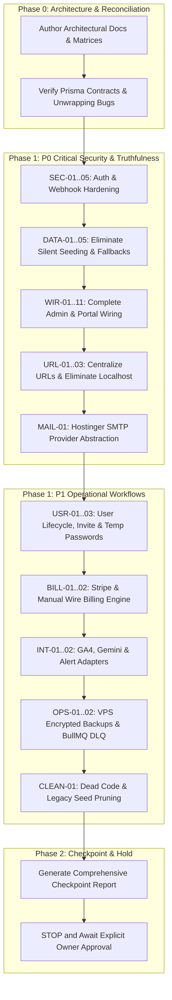

# CYBERSTYLE LLC — Production-Readiness Reconciliation & Audit Plan

**Document Version:** 1.0.0  
**Date:** September 21, 2026  
**Auditor:** Principal Full-Stack, Security, DevOps, Database Reliability & QA Lead  
**Scope:** Monorepo (`apps/web`, `apps/api`, `packages/*`, `prisma`, `infra`, `scripts`)

---

## 1. Executive Reconciliation Summary

This document reconciles all known and discovered architectural, security, data-integrity, and functional discrepancies against the actual CYBERSTYLE monorepo codebase. Every finding is backed by file paths, line numbers, root-cause analyses, risk evaluations, and exact remediation specifications.

All changes are staged under strict owner constraints:
1. **Zero live VPS deployment or live database manipulation** during this repair phase.
2. **Zero destructive database operations** (`prisma migrate reset`, table drops, truncations).
3. **P0 (Critical Pre-Launch Blockers)** and **P1 (Pre-Traffic Operational Requirements)** must be completely implemented, wired to real persistent Prisma models, tested, and verified before requesting owner approval for P2.
4. **Zero simulated success or fake fallbacks** in any production path.

---

## 2. Reconciliation Matrix

| Finding ID | Severity | File & Location | Affected Role & Env | Root Cause | Recommended Fix | Data Impact | Test Strategy | Decision Gate |
| :--- | :--- | :--- | :--- | :--- | :--- | :--- | :--- | :--- |
| **SEC-01** | **P0** | `apps/api/src/services/auth.service.ts:L70` | All Users (Prod/Dev) | `validateSession` does not check `user.status === UserStatus.ACTIVE`. | Add check: `if (session.user.status !== UserStatus.ACTIVE) return null;` | None | Unit test suspended user session validation rejection. | Safe Auto-Fix |
| **SEC-02** | **P0** | `apps/api/src/services/file-security.service.ts:L72` | Clients & Admins (Prod) | Hardcoded HMAC fallback string `'cyberstyle-file-security-hmac-key-default-2026'`. | Require `env.SESSION_SECRET`; throw fatal startup error in production if missing. | None | Test HMAC signed URL validation with missing secret. | Safe Auto-Fix |
| **SEC-03** | **P0** | `docker-compose.prod.yml:L51,L87,L108,L124` | DevOps / Infra (Prod) | Password fallback strings (`123456789`, `redis_secure_password`, `jwt_production_secret_key_change_me`). | Replace with `${POSTGRES_PASSWORD:?Required}` and `${REDIS_PASSWORD:?Required}`. | None | Validate with `docker compose config`. | Safe Auto-Fix |
| **SEC-04** | **P0** | `apps/api/src/routes/auth.routes.ts:L23` | All Users (Prod) | Hardcoded `domain: '.cyberstyle.net'` fails on staging, IP, or localhost testing. | Use `process.env.COOKIE_DOMAIN \|\| undefined`. | None | Verify cookie header in auth tests. | Safe Auto-Fix |
| **SEC-05** | **P0** | `apps/api/src/routes/invoices.routes.ts:L20` | Stripe Webhooks (Prod) | `express.raw()` placed after global `express.json()` middleware in `server.ts`. | Capture raw body buffer via `express.json({ verify: (req, _res, buf) => { req.rawBody = buf; } })`. | None | Stripe CLI mock webhook signature test. | Safe Auto-Fix |
| **DATA-01** | **P0** | `apps/api/src/routes/content.routes.ts:L224` | Public Visitors (Prod) | `seedDefaultContentIfEmpty()` runs automatically on module load. | Remove startup execution; require explicit admin creation or seed script. | No data loss | Verify clean startup with empty DB does not create rows. | Safe Auto-Fix |
| **DATA-02** | **P0** | `apps/api/src/routes/geo.routes.ts:L86` | Admins (Prod) | `seedDefaultGeoQueriesIfEmpty()` runs automatically on module load, seeding fake ranking scores. | Remove startup execution. | No data loss | Verify clean startup leaves GeoQuery table unchanged. | Safe Auto-Fix |
| **DATA-03** | **P0** | `apps/api/src/services/email.service.ts:L517` | Admins (Prod) | `seedDefaultThreadsIfEmpty()` runs automatically on `listThreads`. | Remove startup execution; only show genuine threads. | No data loss | Verify empty inbox renders clean empty state. | Safe Auto-Fix |
| **DATA-04** | **P0** | `apps/api/src/utils/fallbackContent.ts` | Public Visitors (Prod) | Injects `FALLBACK_CASE_STUDIES`, `FALLBACK_REVIEWS`, `FALLBACK_FAQS` with fake `.example.com` domains. | Remove fallback injection in API routes; return empty arrays or unpublish demo content. | Unpublish demo rows | Verify API returns `[]` when no published rows exist. | Safe Auto-Fix |
| **DATA-05** | **P0** | `apps/api/src/services/analytics.service.ts:L60-87` | Admins (Prod) | Mathematical formula generates fake sessions (4,850), users (3,420), and GSC rankings. | Remove simulation formulas. Return `{ connected: false, metrics: null }` if GA4/GSC unconfigured. | None | Test `/analytics/overview` returns disconnected status. | Safe Auto-Fix |
| **WIR-01** | **P0** | `apps/web/src/app/(admin)/admin/milestones/page.tsx:L133` | Admins (Prod/Dev) | Static `SAMPLE_MILESTONES` state; never calls `GET /admin/milestones`. | Add `useEffect` calling `GET /admin/milestones`; wire create, update, delete modals to API. | None | Playwright / API milestone CRUD test. | Safe Auto-Fix |
| **WIR-02** | **P0** | `apps/web/src/app/(admin)/admin/projects/page.tsx:L85` | Admins (Prod/Dev) | Static `SAMPLE_PROJECTS` state; never calls `GET /admin/projects`. | Add `useEffect` calling `GET /admin/projects`; wire create, update, delete modals to API. | None | Playwright / API project CRUD test. | Safe Auto-Fix |
| **WIR-03** | **P0** | `apps/web/src/app/(admin)/admin/roadmap/page.tsx:L30` | Admins (Prod/Dev) | Static `SAMPLE_ROADMAP` state; never calls `GET /admin/roadmap`. | Add `useEffect` calling `GET /admin/roadmap`; wire create, update, delete to API. | None | Playwright / API roadmap test. | Safe Auto-Fix |
| **WIR-04** | **P0** | `apps/web/src/app/(admin)/admin/payments/page.tsx:L81` | Admins (Prod/Dev) | Static `SAMPLE_PAYMENTS`; Express API has no `GET /admin/payments` route. | Implement `GET /admin/payments` and `POST /admin/payments/manual-wire` on API; wire frontend. | None | Payment ledger test. | Safe Auto-Fix |
| **WIR-05** | **P0** | `apps/web/src/app/(admin)/admin/proposals/page.tsx:L64` | Admins (Prod/Dev) | Calls wrong route `/proposals/${id}/approve` (404) and fakes success in catch block. | Fix route to `/admin/ai/proposals/${id}/approve`; remove fake-success catch block. | None | Proposal approve test. | Safe Auto-Fix |
| **WIR-06** | **P0** | `apps/web/src/app/(admin)/admin/clients/page.tsx:L65`, `contacts/page.tsx:L54`, `retainers/page.tsx:L55` | Admins (Prod/Dev) | Frontend checks `Array.isArray(res.data)` but API returns `{ clients: [...] }`, forcing demo fallbacks. | Normalize unwrapping: `const list = res.data?.clients \|\| res.data \|\| [];`. | None | Verify real DB records render in tables. | Safe Auto-Fix |
| **WIR-07** | **P0** | `apps/web/src/app/(portal)/portal/projects/[id]/page.tsx:L188` | Clients (Prod/Dev) | Contains `// Simulate /api/portal/milestones/:id/approve` with `.catch(() => null)`. | Replace simulation with `apiRequest('/portal/milestones/' + id + '/approve', { method: 'POST' })`. | Persistent milestone status | Verify approval persists to PostgreSQL. | Safe Auto-Fix |
| **WIR-08** | **P0** | `apps/web/src/app/(portal)/portal/messages/page.tsx:L149` | Clients (Prod/Dev) | Chat pushes to in-memory `SAMPLE_MESSAGES` object; never calls API. | Wire to `GET /messaging/threads` and `POST /messaging/threads/:id/messages`. | Persistent messages | Verify message persists across refresh. | Safe Auto-Fix |
| **WIR-09** | **P0** | `apps/web/src/app/(portal)/portal/feedback/page.tsx:L28` & `portal/reviews/page.tsx:L18` | Clients (Prod/Dev) | `setTimeout` simulation fakes submission without saving to DB. | Wire feedback to messaging/ticket API; wire review to `POST /api/reviews`. | Persistent reviews | Verify feedback/review saves to DB. | Safe Auto-Fix |
| **WIR-10** | **P0** | `apps/web/src/app/(portal)/portal/invoices/page.tsx` & `portal/retainers/page.tsx` | Clients (Prod/Dev) | Renders `DEMO_WORKSPACE_DATA.sampleInvoices` and hardcoded $7,500/mo plan. | Query real tenant invoices and subscriptions; render `EmptyState` when empty. | None | Test zero-invoice client view. | Safe Auto-Fix |
| **WIR-11** | **P0** | `apps/web/src/components/portal/PortalTopBar.tsx:L40` | Clients (Prod/Dev) | Calls `/portal/profile` which 404s on Express API, silently defaulting to "Demo Client". | Implement `GET /portal/profile` returning authenticated client organization and profile. | None | Verify top bar displays real client name. | Safe Auto-Fix |
| **URL-01** | **P0** | `apps/web/src/app/(admin)/admin/messages/page.tsx:L291,L844` | Admins (Prod) | Hardcoded `http://localhost:4000/api/v1/messaging/files` for uploads and downloads. | Replace with `${getApiBaseUrl()}/messaging/files`. | None | Test upload/download on remote host. | Safe Auto-Fix |
| **URL-02** | **P0** | `apps/api/src/services/messaging.service.ts:L352`, `milestone-delivery.service.ts:L94`, `auth.routes.ts:L453`, `admin.routes.ts:L1863` | All Users (Prod) | Hardcoded `http://localhost:3000` in outbound email links. | Use `process.env.APP_URL \|\| 'https://cyberstyle.net'`. | None | Verify email dispatch body contains production domain. | Safe Auto-Fix |
| **URL-03** | **P0** | `apps/web/src/app/(admin)/admin/case-studies/page.tsx:L414` & `blog/page.tsx:L337` | Public / SEO (Prod) | Generates canonical URLs with `https://cyberstyle.agency` instead of `https://cyberstyle.net`. | Replace with `https://cyberstyle.net`. | None | Verify sitemap and metadata URLs. | Safe Auto-Fix |
| **MAIL-01**| **P0** | `apps/api/src/services/email.service.ts:L140` | Email Operations (Prod) | Falls back to `smtp.ethereal.email` with mock credentials if SMTP is unconfigured. | Implement Hostinger SMTP provider abstraction; fail clearly if unconfigured. Never mock in prod. | None | Verify email failure alert when SMTP unconfigured. | Safe Auto-Fix |
| **USR-01** | **P1** | `apps/api/src/routes/admin.routes.ts` | Super Admins (Prod/Dev) | Missing endpoints for user suspension, archival, and deletion. | Implement `PATCH /users/:id/status` (ACTIVE/SUSPENDED/ARCHIVED) and `DELETE /users/:id` with safety checks. | Audit log created | Test session invalidation upon user suspension. | Safe Auto-Fix |
| **USR-02** | **P1** | `apps/api/src/routes/admin.routes.ts:L1830` | Super Admins (Prod/Dev) | Invitation workflow lacks one-time expiring hashed token acceptance flow. | Implement token generation, hashing (`sha256`), expiry (72h), and `POST /auth/invitation/accept`. | `VerificationToken` rows | Test invitation email, token redemption, and login. | Safe Auto-Fix |
| **USR-03** | **P1** | `apps/api/src/routes/auth.routes.ts` | All Users (Prod/Dev) | Forced password change on first login not enforced for temporary passwords. | Add `mustChangePassword` boolean flag check in login and `/auth/change-password` flow. | `User` model flag | Test temp-password login redirection. | Safe Auto-Fix |
| **BILL-01**| **P1** | `apps/api/src/routes/invoices.routes.ts` | Finance / Clients (Prod) | Lacks manual bank-wire payment recording and reconciliation endpoint. | Implement `POST /api/invoices/:id/payments/manual-wire` with admin authorization and audit logging. | `Payment` & `AuditLog` | Test manual payment recording and invoice settling. | Safe Auto-Fix |
| **BILL-02**| **P1** | `apps/api/src/services/stripe.service.ts:L7` | Finance / Clients (Prod) | Hardcoded `'sk_test_mock_stripe_key'`; no graceful unconfigured state. | If `STRIPE_SECRET_KEY` is unset, report `{ configured: false }` and disable checkout gracefully. | None | Verify checkout throws clear operational error. | Safe Auto-Fix |
| **INT-01** | **P1** | `apps/api/src/services/analytics.service.ts` | Admins (Prod) | No GA4 server-side Data API provider integration. | Implement GA4 provider adapter with typed `NOT_CONFIGURED` / `CONNECTED` state. | `AnalyticsCache` rows | Test GA4 unconfigured response. | Safe Auto-Fix |
| **INT-02** | **P1** | `apps/api/src/services/alert.service.ts` | DevOps / Admins (Prod) | Alert service lacks Slack / Discord webhook dispatch for BullMQ DLQ and backup failures. | Implement webhook dispatcher for operational alerts. | None | Test alert trigger on worker job failure. | Safe Auto-Fix |
| **OPS-01** | **P1** | `scripts/backup-db.sh` (new) | DevOps (Prod) | No automated encrypted PostgreSQL backup script for VPS disk. | Create AES-256 encrypted `pg_dump` script with retention policy and alert hooks. | Backup archives | Run backup and verify restore drill on test database. | Safe Auto-Fix |
| **OPS-02** | **P1** | `apps/api/src/routes/monitoring.routes.ts` (new) | Super Admins (Prod) | No BullMQ Dead Letter Queue (DLQ) visibility endpoint for super admins. | Implement `GET /admin/queues/dlq` with sanitized metadata and retry/remove controls. | Audit logs | Test DLQ inspection and retry. | Safe Auto-Fix |
| **CLEAN-01**| **P1**| Monorepo Root & Subdirs | Developers / CI | Dead files: `googleMapsScraper.js` (2 bytes), `gh` (0 bytes), `prisma/seed.js` (insecure SHA-256), `seed_db.js`. | Delete dead files; archive obsolete test scripts. | None | Verify CI build and typechecks succeed. | Safe Auto-Fix |

---

## 3. Implementation Phasing Strategy

---

## 4. Verification & Testing Guardrails

To ensure zero regressions and maintain production safety:
1. **Isolated Test Infrastructure**: All verification runs against disposable test databases (`cyberstyle_test_db` on port 5432 or 5433) and local Redis (`localhost:6379`).
2. **Never Touch Production Data**: The production database (`db_agency_prod` on port 5434) is strictly untouched during testing.
3. **Automated Verification Pipeline**:
   - `npm run ci:typecheck` (must pass with 0 errors).
   - `npm run ci:test` (all security, auth, and tenant isolation tests must pass).
   - `npm run test:owasp --workspace=@cyberstyle/api` (OWASP compliance suite must pass).
   - `npm run ci:build` (production Next.js and Express builds must compile cleanly).
   - `docker compose -f docker-compose.prod.yml config` (must validate cleanly).
