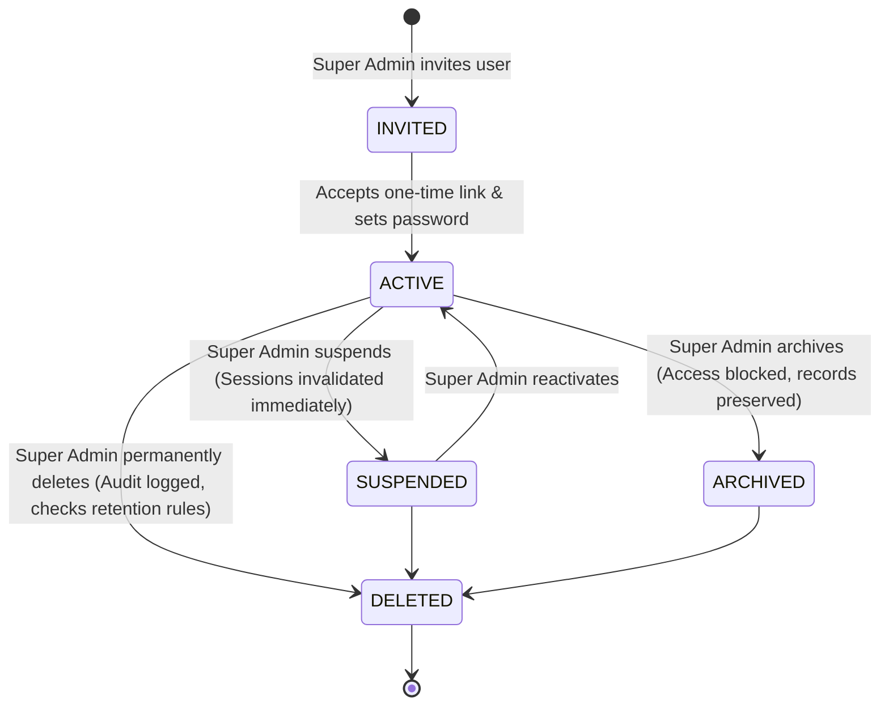

# CYBERSTYLE LLC — Security Threat Model & Defense-in-Depth Specification

**Document Version:** 1.0.0  
**Date:** September 21, 2026  
**Scope:** Application Security, Multi-Tenant Isolation, Cryptography, Identity Governance, and Operational Resilience

---

## 1. STRIDE Threat Analysis Matrix

| Threat Category | Target / Asset | Attack Vector / Vulnerability | Mitigating Architecture & Implementation |
| :--- | :--- | :--- | :--- |
| **Spoofing** | User Identity & Sessions | Session hijacking, cookie theft, or stolen session token. | `HttpOnly`, `Secure`, `SameSite=Lax` cookies; database-backed session validation querying `UserStatus === ACTIVE`; session revocation on password change or role update. |
| **Spoofing** | Stripe Webhooks | Forged payment confirmation events posted to webhook URL. | Raw request body capture with `stripe.webhooks.constructEvent` verification; HMAC validation using `STRIPE_WEBHOOK_SECRET`; replay prevention via `StripeWebhookEvent` unique `eventId` indexing. |
| **Tampering** | File Vault Downloads | Path traversal (`../../etc/passwd`) or tampering with file download URLs. | Signed HMAC-SHA256 tokens with 15-minute expiration; file storage partitioned by UUID in local Docker volumes; strict sanitization of filename characters. |
| **Tampering** | Invoice Status | Client attempting to mark invoices as PAID via frontend URL parameters or state manipulation. | Server-side authorization check: Invoices can only transition to `PAID` via verified Stripe webhook event transactions or audited manual-wire recording by an authorized `SUPER_ADMIN`. |
| **Repudiation** | Administrative Mutations | Rogue administrator deleting clients, issuing refunds, or altering roles. | Immutable cryptographically-chained `AuditLog` records containing SHA-256 parent hashes, actor ID, client IP, user agent, and before/after mutation diffs. |
| **Information Disclosure** | Multi-Tenant Data | Insecure Direct Object Reference (IDOR) on invoices, files, or message threads. | Tenant boundary enforcement at database query level: Every query scoped to `organizationId === actor.organizationId`; Super Admin access required for cross-tenant visibility. |
| **Information Disclosure** | User Enumeration | Attacker querying `/auth/forgot-password` to discover valid administrative emails. | Constant-time, enumeration-safe response: Always return identical generic success message whether email exists or not. |
| **Denial of Service** | Public Forms | Automated bots flooding `/contact` or `/start-project` endpoints. | IP-based rate limiting (5 requests / 15 minutes per IP); optional Cloudflare Turnstile cryptographic challenge verification. |
| **Elevation of Privilege** | User Lifecycle | User modifying payload `role: "SUPER_ADMIN"` during registration or profile update. | Zero public registration; invite-only model; role assignment restricted to authenticated `SUPER_ADMIN` with database constraint validation. |

---

## 2. Cryptographic Security Standards

1. **Password Hashing**: Argon2id with recommended OWASP memory cost parameters (64 MB, 3 iterations, 4 parallelism threads) or bcrypt with minimum work factor 12.
2. **Session Tokens**: 256-bit entropy generated via Node.js `crypto.randomBytes(32).toString('hex')`, stored hashed in PostgreSQL `Session` table.
3. **Invitation & Password Reset Tokens**: High-entropy 32-byte tokens. Transmitted once in expiring email links; stored in database as `sha256(token)` to prevent offline credential theft if database is dumped.
4. **Two-Factor Authentication (2FA)**: RFC 6238 TOTP (Time-based One-Time Password) with base32 secret encryption at rest; single-use 8-character alphanumeric backup codes stored hashed with bcrypt.
5. **HMAC File Signatures**: SHA-256 HMAC calculated over `fileId:userId:expiresTimestamp` using server secret `SESSION_SECRET`.

---

## 3. Identity Lifecycle & Tenant Isolation Model

### 3.1 Tenant Isolation Rules
1. **Never trust client-provided IDs**: Every request parses the actor's session. If actor role is `CLIENT`, all database lookups force `where: { organizationId: actor.organizationId }`.
2. **Resource Not Found Isolation**: When a tenant queries an ID belonging to another organization, the API must return `404 Not Found` (never `403 Forbidden`) to prevent resource existence enumeration.
3. **Storage Isolation**: Uploaded deliverables are stored in private paths inaccessible via direct web server routes, served exclusively through authorized streaming proxies after permission verification.

---

## 4. OWASP Top 10 Compliance Verification

- **A01: Broken Access Control**: Enforced via `requireAuth` and `requireRole` middleware; all database queries enforce organization scoping.
- **A02: Cryptographic Failures**: HTTPS enforced; TLS 1.3 preferred; all production database passwords and secrets generated with 256-bit crypto randomness; zero hardcoded fallback strings.
- **A03: Injection**: 100% of database interactions executed via Prisma ORM parameterized queries; raw SQL is strictly prohibited.
- **A04: Insecure Design**: Invite-only registration; zero demo data in production; fail-fast environment validation.
- **A05: Security Misconfiguration**: Helmet security headers configured (CSP, HSTS, X-Content-Type-Options); CORS restricted to explicit origin whitelist; debug stack traces disabled in production.
- **A06: Vulnerable and Outdated Components**: Automated audit with `npm audit`; pinned production dependencies; Alpine Linux base images.
- **A07: Identification and Authentication Failures**: Brute-force rate limiting; 2FA TOTP support; session invalidation on credential changes; constant-time password comparison.
- **A08: Software and Data Integrity Failures**: Raw body Stripe webhook signature verification; cryptographically chained audit logging.
- **A09: Security Logging and Monitoring Failures**: Pino structured logging with correlation IDs; automatic audit logging on all administrative mutations.
- **A10: Server-Side Request Forgery (SSRF)**: Whitelisted outbound HTTP destinations; Gemini and Stripe API endpoints hardcoded to official HTTPS hostnames.
