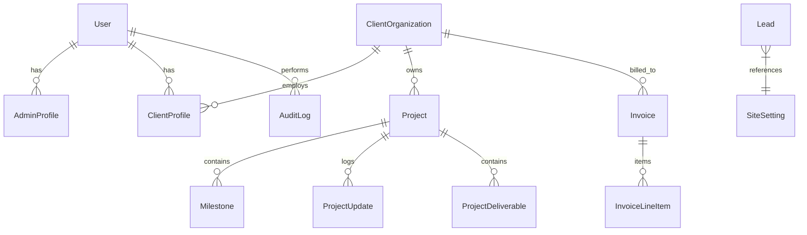

# CYBERSTYLE LLC — Full System Specification, Architecture & Engineering Audit

**Author**: Senior Full-Stack Architect & AI Systems Engineer  
**Classification**: Production Engineering Documentation & Technical Audit  
**Audience**: Executive Leadership, Project Stakeholders, Team Leads & Senior Engineers  
**Date of Audit**: September 2026  
**Repository State**: Verified Production Build (Turborepo Monorepo)

---

## 1. Executive Summary & Purpose

The **CYBERSTYLE Platform** is an enterprise-grade digital infrastructure engineered specifically for high-ticket service sales, client onboarding, automated CRM lead capture, interactive 3D web experiences, and secure client operations.

The platform eliminates disparate, uncoordinated third-party tools (forms, scheduling, spreadsheets, file vaults) by unifying:
1. **Public High-Conversion Web Showcase** with custom Three.js WebGL shaders and sub-second Core Web Vitals.
2. **Dynamic Inbound Project Funnel** (`/start-project`) with anti-spam honeypot and multi-step qualification.
3. **Dedicated Admin Mission Control** (`/admin` & `/admin/login`) with CRM lead pipeline staging, project tracking, and transactional email queuing.
4. **Client Operations Portal** (`/portal`) with project milestone tracking, downloadable deliverables vault, and invoice ledger.
5. **Express.js API Engine & PostgreSQL Database** with 32 normalized data models, Redis BullMQ workers, and Argon2id cryptographic security.

---

## 2. High-Level System Architecture

```mermaid
flowchart TB
    subgraph Client Tier [Browser & Devices]
        PublicVisitor["Public Visitor / Prospect"]
        ClientUser["Authenticated Client (/portal)"]
        AdminUser["Authenticated Executive Admin (/admin)"]
    end

    subgraph Edge & Routing [Port 80 / 443]
        NginxProxy["Nginx Reverse Proxy (TLS 1.3 / HTTP/2)"]
    end

    subgraph Application Tier [Docker Network]
        NextApp["Next.js 15 App Router (SSR/SSG :3000)"]
        ExpressAPI["Express.js REST API Engine (:4000)"]
    end

    subgraph Data & Worker Tier [Persistence & Queue]
        PostgreSQL[("PostgreSQL 16 (32 Prisma Models :5432)")]
        RedisQueue[("Redis 7 Cache & BullMQ Queue :6379")]
        BullWorker["BullMQ Email & Notification Worker"]
    end

    subgraph External Providers
        SMTPRelay["SMTP Gateway (Mailgun / AWS SES)"]
        StripeGateway["Stripe Payments API"]
    end

    PublicVisitor -->|HTTPS| NginxProxy
    ClientUser -->|HTTPS (HttpOnly Cookies)| NginxProxy
    AdminUser -->|HTTPS (Argon2id Session)| NginxProxy

    NginxProxy -->|/ or /portal/* or /admin/*| NextApp
    NginxProxy -->|/api/*| ExpressAPI

    NextApp -.->|Server Component Fetch| ExpressAPI
    ExpressAPI -->|Prisma Transactions| PostgreSQL
    ExpressAPI -->|Dispatch Async Jobs| RedisQueue
    RedisQueue --> BullWorker
    BullWorker -->|Transactional Alerts| SMTPRelay
    ExpressAPI -->|Hosted Checkout & Webhooks| StripeGateway
```

---

## 3. Complete File-by-File Codebase Directory & File Inventory

Below is an exhaustive inventory of every file in the active repository with its functional purpose and engineering role.

```
agency project/
├── .env.example                       # Root environment variables reference
├── docker-compose.yml                 # Local development multi-container orchestration
├── docker-compose.prod.yml            # Production VPS Docker Compose (Next.js, API, Postgres, Redis)
├── package.json                       # Turborepo root package.json & workspaces definition
├── turbo.json                         # Turborepo task pipeline configuration (dev, build, lint, test)
│
├── apps/
│   ├── api/                           # Express.js REST API Backend
│   │   ├── package.json               # Backend dependencies (Express, Prisma, BullMQ, Argon2, Helmet)
│   │   ├── tsconfig.json              # Backend TypeScript configuration
│   │   └── src/
│   │       ├── index.ts               # API bootstrap & database connection health check
│   │       ├── server.ts              # Express application configuration, middlewares, routes mounting
│   │       ├── config/
│   │       │   └── index.ts           # Type-safe environment variable parsing & validation
│   │       ├── middleware/
│   │       │   ├── auth.ts            # Role-based access control (SUPER_ADMIN, CLIENT, STAFF)
│   │       │   ├── error.ts           # Global error handler & structured JSON responses
│   │       │   └── rateLimit.ts       # Sliding-window rate limiters for auth & public leads
│   │       ├── queues/
│   │       │   └── email.queue.ts     # BullMQ Redis worker for asynchronous transactional emails
│   │       ├── routes/
│   │       │   ├── admin.routes.ts    # Admin telemetry, CRM lead staging, invoice creation
│   │       │   ├── auth.routes.ts     # User registration, login, session token validation
│   │       │   ├── health.routes.ts   # Infrastructure heartbeat & readiness probes (/api/health)
│   │       │   ├── leads.routes.ts    # Lead ingestion, honeypot verification, validation
│   │       │   └── portal.routes.ts   # Client portal projects, milestones, and invoice queries
│   │       ├── services/
│   │       │   ├── auth.service.ts    # Argon2id password hashing, verification, session tokens
│   │       │   ├── email.service.ts   # Nodemailer SMTP transporter & HTML layout builders
│   │       │   └── lead.service.ts    # Lead persistence & notification dispatching
│   │       └── utils/
│   │           └── logger.ts          # Structured logging utility with ISO timestamps
│   │
│   └── web/                           # Next.js 15 App Router Frontend
│       ├── package.json               # Frontend dependencies (Next 15, React 19, Three.js, Lucide)
│       ├── tsconfig.json              # Web TypeScript configuration
│       └── src/
│           ├── app/
│           │   ├── layout.tsx         # Root HTML shell, typography tokens, cookie banner mounting
│           │   ├── globals.css        # Global CSS variables, cyber-aesthetic styles, selection colors
│           │   ├── not-found.tsx      # Custom HTTP 404 page with navigation fallback
│           │   ├── page.tsx           # Monumental homepage (3D Silk hero, services, card, FAQ, CTA)
│           │   ├── sitemap.ts         # Dynamic programmatic XML sitemap generator
│           │   ├── robots.ts          # Search engine crawler directives
│           │   │
│           │   ├── about/             # /about page (agency philosophy, standards, leadership)
│           │   ├── blog/              # /blog directory (technical essays & SEO articles)
│           │   │   └── [slug]/        # /blog/[slug] dynamic reader page
│           │   ├── contact/           # /contact page (direct communication & inquiry channels)
│           │   ├── cookies/           # /cookies compliance and privacy disclosure
│           │   ├── faq/               # /faq engineering, 3D, and pricing accordion directory
│           │   ├── pricing/           # /pricing packages ($800+, $1,200+, $3,000+ comparison)
│           │   ├── privacy/           # /privacy GDPR/CCPA data handling policy
│           │   ├── reviews/           # /reviews client testimonials and performance ratings
│           │   ├── services/          # /services high-level capabilities overview
│           │   │   ├── premium-web/   # /services/premium-web dedicated service landing page
│           │   │   ├── ai-automation/ # /services/ai-automation dedicated service landing page
│           │   │   └── custom-saas/   # /services/custom-saas dedicated service landing page
│           │   ├── start-project/     # /start-project multi-step interactive onboarding questionnaire
│           │   ├── terms/             # /terms master client service agreement terms
│           │   ├── work/              # /work case studies showcase directory
│           │   │   └── [slug]/        # /work/[slug] deep-dive project case study template
│           │   │
│           │   ├── admin/             # Dedicated Admin Suite
│           │   │   ├── page.tsx       # /admin smart route router (redirects to /admin/login or dashboard)
│           │   │   ├── login/         # /admin/login dedicated executive authentication portal
│           │   │   └── dashboard/     # /admin/dashboard comprehensive operations mission control
│           │   │
│           │   └── portal/            # Dedicated Client Operations Portal
│           │       ├── page.tsx       # /portal client dashboard (milestones, progress, vault)
│           │       └── invoices/      # /portal/invoices client financial ledger & Stripe payment CTA
│           │
│           └── components/
│               ├── backgrounds/
│               │   └── Silk.tsx       # Three.js WebGL fluid wave shader with DPR clamping
│               ├── layout/
│               │   ├── Header.tsx     # Global fixed glassmorphic header with CYBERSTYLE wordmark
│               │   ├── Footer.tsx     # Global footer with monumental mail CTA & multi-column links
│               │   └── PageBanner.tsx # Standardized inner-page hero banner with Silk background
│               └── ui/
│                   ├── Badge.tsx      # Clean mono status badge component
│                   ├── Button.tsx     # Primary, electric, and outline buttons with hover glow
│                   ├── Card.tsx       # Glassmorphic cyber cards with border highlights
│                   └── CookieConsent.tsx # GDPR/CCPA interactive cookie banner
│
├── packages/
│   ├── config/                        # Shared TypeScript configurations
│   ├── email/                         # Reusable HTML email templates
│   └── ui/                            # Design tokens and shared styling primitives
│
├── prisma/
│   ├── schema.prisma                  # Normalized PostgreSQL database schema (32 models)
│   └── seed.ts                        # Database seeder (Admin, Apex Capital, Projects, Invoices)
│
├── infra/
│   ├── nginx/                         # Nginx production configuration and TLS rules
│   └── scripts/                       # Database backup (backup.sh) and restore (restore.sh) scripts
│
└── docs/
    ├── architecture.md                # System architecture documentation
    ├── api.md                         # REST API endpoint reference
    ├── env-var-reference.md           # Environment variables classification matrix
    ├── launch-checklist.md            # Production launch and DevOps runbook
    ├── security.md                    # Cryptographic and session security policy
    ├── testing-strategy.md            # Automated and manual verification strategy
    ├── ui-extraction.md               # UI component tokens reference
    └── SYSTEM_SPECIFICATION_REPORT.md # This comprehensive technical specification report
```

---

## 4. Full Features & Capabilities Breakdown

### A. Public Web Experience
* **Sub-Second Core Web Vitals**: Clamped device pixel ratio (DPR `1.0–1.5`), frame throttling, and instant fallback for reduced motion environments.
* **Transparent Service Pricing Architecture**:
  * 🌐 **Web Architecture & 3D Shaders** (from **$800+**)
  * 🤖 **AI & Business Automation** (from **$1,200+**)
  * ⚡ **Custom SaaS Platforms** (from **$3,000+**)
* **Multi-Step Lead Capture Funnel** ([`/start-project`](file:///c:/Users/Hani/OneDrive/Desktop/agency%20project/apps/web/src/app/start-project/page.tsx)):
  * 4-step wizard capturing service selection, estimated budget, desired timeline, and business goals.
  * Anti-bot honeypot fields that silently reject automated spam.

### B. Dedicated Executive Admin Mission Control (`/admin` & `/admin/login`)
* **Dedicated Authentication Portal** ([`/admin/login`](file:///c:/Users/Hani/OneDrive/Desktop/agency%20project/apps/web/src/app/admin/login/page.tsx)):
  * Dark luxury UI with Argon2id encrypted authentication, error handling, and one-click demo autofill (`admin@cyberstyle.net / Admin123456!`).
* **Live System Telemetry & KPIs**:
  * Total Inbound Pipeline Value ($14,500+).
  * Invoiced Realized Revenue ($1,200.00).
  * Active Client Projects & Delivery Status.
  * Infrastructure Health Indicators (Next.js, Express, Postgres, Redis).
* **Interactive Inbound CRM Pipeline Manager**:
  * Visual status advancement (`NEW` $\rightarrow$ `CONTACTED` $\rightarrow$ `QUALIFIED` $\rightarrow$ `PROPOSAL_SENT` $\rightarrow$ `WON` $\rightarrow$ `LOST`).
  * Direct prospect mail trigger and detailed note inspection.
* **Project & Milestones Manager**:
  * Overview of client builds, milestone progress percentage, and due dates.
* **Financial Ledger & Invoices**:
  * View paid vs. due invoices (`INV-2026-0041` [PAID], `INV-2026-0089` [DUE]).
* **Transactional Email Queue Simulator**:
  * Test email dispatching via Redis BullMQ queue.
* **System Roadmap & Expansion Planner**:
  * Built-in roadmap view outlining next engineering phases.

### C. Client Operations Portal (`/portal`)
* **Client Organization Isolation**: Users only see projects and invoices belonging to their `organizationId`.
* **Milestone Progression Tracker**: Visual step-by-step progression (e.g. Apex Capital 75% complete).
* **Deliverables Vault**: Downloadable project specifications, architecture PDFs, and design kits.
* **Invoices & Stripe Payment Triggers** ([`/portal/invoices`](file:///c:/Users/Hani/OneDrive/Desktop/agency%20project/apps/web/src/app/portal/invoices/page.tsx)): View billing history, line items, and trigger Stripe checkout.

---

## 5. Security Model, Authentication & Data Relationships

### Cryptographic Standard
* **Argon2id**: Memory-hard password hashing with parameters: `memoryCost: 65536` (64 MB), `timeCost: 3`, `parallelism: 4`.
* **Session Security**: 64-byte cryptographic random hex secrets (`AUTH_SECRET`, `SESSION_SECRET`) generating `HttpOnly`, `Secure`, `SameSite=Strict` cookies.

### Core Database Model Topology (Prisma ORM)



---

## 6. Verification & System Credentials

### Default Seeded System Accounts

| Role | Email | Password | Access Scope |
|---|---|---|---|
| **Super Admin** | `admin@cyberstyle.net` | `Admin123456!` | Full Admin Console ([`/admin`](file:///c:/Users/Hani/OneDrive/Desktop/agency%20project/apps/web/src/app/admin/login/page.tsx)), CRM pipeline, project management, invoices |
| **Demo Client** | `client@apexcapital.com` | `Client123456!` | Client Portal ([`/portal`](file:///c:/Users/Hani/OneDrive/Desktop/agency%20project/apps/web/src/app/portal/page.tsx)), milestone tracker, invoice payment, asset downloads |

---

## 7. Verification & Production Deployment Commands

### Local Development
```bash
# Install dependencies
npm install

# Run database migrations and seed demo data
npm run prisma:migrate
npm run prisma:seed

# Launch Next.js web (Port 3000) and Express API (Port 4000)
npm run dev
```

### Production Docker Deployment (VPS)
```bash
# 1. Build and run production containers in background
docker compose -f docker-compose.prod.yml up --build -d

# 2. Check health
curl -f http://localhost:4000/api/health
```

---

## 8. Strategic Revenue Expansion Roadmap

1. **Stripe Webhook Synchronization**: Real-time event listener marking invoices as `PAID` instantly upon Stripe checkout completion.
2. **AI Lead Scoring Integration**: Automatically score incoming project budgets and requirements from `/start-project` using Gemini or OpenAI models.
3. **Monthly Retainer Management ($500 – $2,000/mo)**: Automated recurring subscriptions for ongoing conversion rate optimization (CRO) and AI automation maintenance.
4. **Interactive ROI Calculator**: Embed a dynamic ROI estimator on `/pricing` showing how an extra 2 qualified deals per month covers the investment 5x over.
