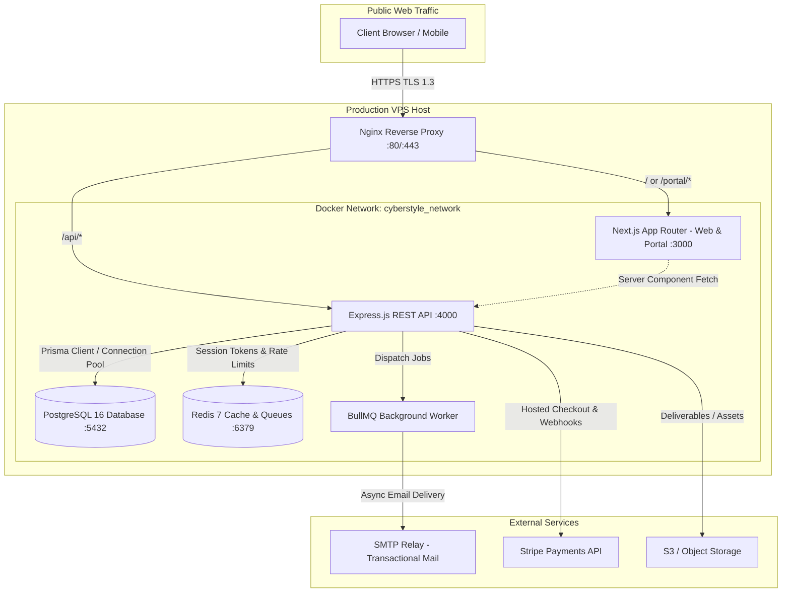

# CYBERSTYLE LLC — System Architecture & Technical Specification

## 1. Monorepo Structure

```
agency project/
├── apps/
│   ├── web/               # Next.js 15 App Router (Marketing, Portal, Admin)
│   └── api/               # Express.js REST API Service (Node 22 / TypeScript)
├── packages/
│   ├── config/            # Shared TypeScript & ESLint configs
│   ├── ui/                # Shared Design System tokens & primitives
│   └── email/             # Nodemailer templates and layout helpers
├── prisma/
│   ├── schema.prisma      # Normalized PostgreSQL schema (30+ models)
│   └── seed.ts            # Admin, settings, and baseline seed data
├── infra/
│   ├── docker-compose.yml # Local Docker container stack
│   ├── docker-compose.prod.yml # Production multi-container VPS configuration
│   ├── nginx/             # Nginx reverse proxy, SSL, and rate limit rules
│   └── scripts/           # Automated backup and disaster recovery scripts
└── docs/                  # Engineering specifications and guides
```

---

## 2. End-to-End System Architecture (Mermaid)



---

## 3. Data Flow & Security Boundaries

1. **Client Isolation**: Client portal users are strictly partitioned by `organizationId`. Admin APIs enforce server-side validation against `UserRole.ADMIN` and `UserRole.SUPER_ADMIN`.
2. **Asynchronous Processing**: High-latency tasks (email dispatch, lead notifications, invoice generation) are pushed to Redis queues via BullMQ and processed by background workers to maintain <100ms API response times.
3. **Database Transactions**: All financial calculations (invoices, line items, payments) and lead captures utilize atomic Prisma transactions (`prisma.$transaction`).
